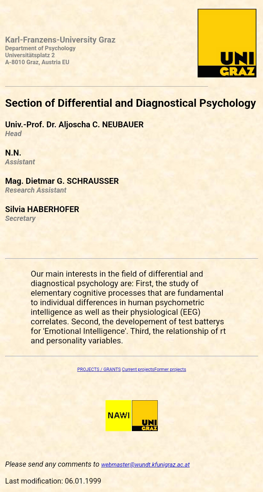

# WebPages 1998-1999

__Official site: Karl-Franzens-University Graz,  
Department of Psychology,  
Section of Differential and Diagnostical Psychology (1998-1999).__

**diffpsy1.html**

*Our main interests in the field of differential and diagnostical psychology are: First, the study of elementary cognitive processes that are fundamental to individual differences in human psychometric intelligence as well as their physiological (EEG) correlates. Second, the developement of test batterys for 'Emotional Intelligence'. Third, the relationship of rt and personality variables.*
